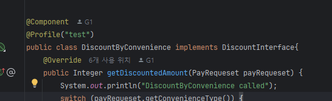
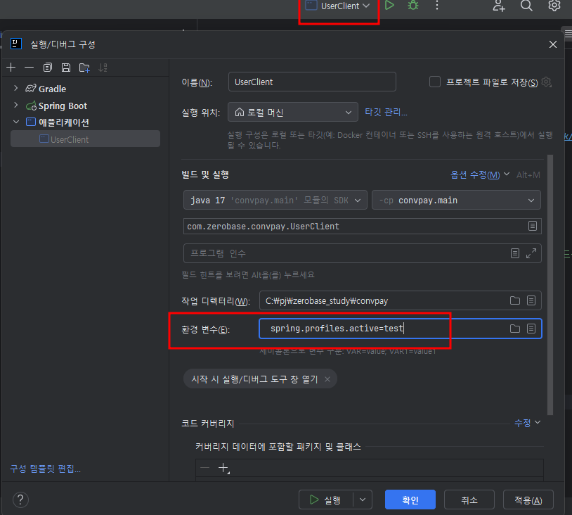

## 다양한 빈 관련 설정 방법

### 1. 빈의 구현체가 여러개인 경우 주입 받는 방법
    1) @Primary : 해당 빈을 최우선으로 주입
    2) @Qualifier("beanName") : beanName으로 지정된 빈을 주입
    3) Set 또는 List로 모두 받기
    4) Property 이름으로 빈과 동일하게 하기 : 가장 흔하게 사용하는 방법

### [2. 빈의 스코프(Scope)](https://docs.spring.io/spring-framework/reference/core/beans/factory-scopes.html)
    - 싱글톤 : 일반적 방법, 하나만 만들어서 계속 재활용
    - Prototype : 매번 새로 만드는 방법(데이터를 클렌징 해야할 때)
    - Request : 요청에 따라 계속 새로 만듦
    - Session : 세션 마다 계속 새로 만듦
    - WebSocket:

### 3. 스프링의 환경설정 : 프로파일(Profile)
    - 현업에서는 환경을 다양하게 하여 해당 환경에서만 동작하는 Bean을 만드는 경우가 있음
    - 클래스단위에 적용하거나 메서드 단위에 적용가능
        - 클래스 단위
            * @Configuration @prorile("test")
            * @Component @prorile("test")
        - 메서드 단위
            * @Bean @Porfile("test")
    - -Dspring.profiles.active=sandbox, beta, production
    - 프로파일 표현식
        * @Profile("!production")
        * ! (not), & (and), | (or)

