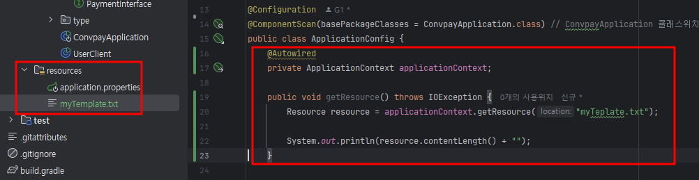
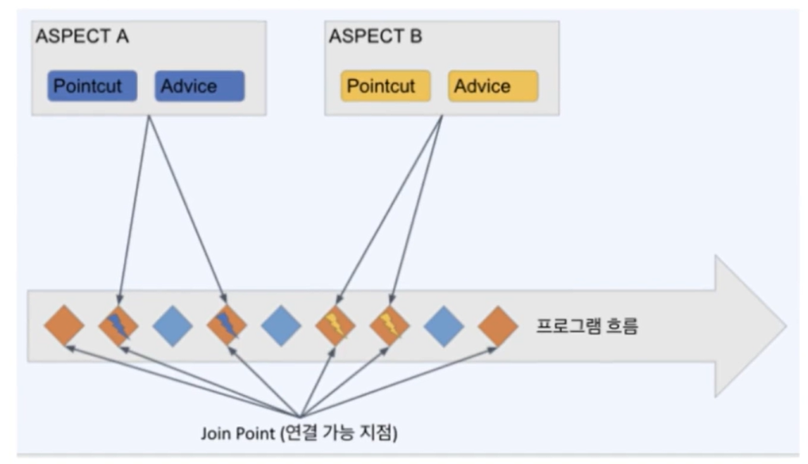

# 2-3 스프링의 부가기능

# 01_ Resource(외부자원 가져오기)
## Resource Interface 와 그 구현체들

```java
public interface Resource extends InputStreamSource {
    boolean exists();
    boolean isReadable();
    boolean isOpen();
    boolean isFile();
    
    URL getURL() throws IOException;
    URL getURI() throws IOException;
    File getFile() throws IOException;

    ReadableByteChannel readableChannel()throws IOException;

    long contentLength() throws IOException;
    long lastModified() throws IOException;
    Resource createRelative(String relativePath) throws IOException;
    String getFilename();
    String getDescription();
}
```

자바의 표준 클래스들은 다양한 리소스(URL, 파일 등)에 접근할 때 충분한 기능을 제공하지 않음, 스프링은 필요한 기능을 만들어서 제공


## Resource 구현체 목록

Srping 내부 Resource 구현체 중 대표적인 몇가지

### UrlResouce

java.net.URL을 래핑한 버전, 다양한 종류(ftp:, file:, http:. 등의 prefix로 접근유형 판단)의 Resource에 접근 가능하지만 기본적으로 http(s)로 원격접근

### ClassPathResource

classpath(소스코드를 빌드한 결과(기본적으로 target/classes 폴더)) 하위의 리소스 접근 시 사용

### FileSystemResource

이름과 같이 File을 다루기 위한 리소스 구현체

### ServletContextResource, InputStreamResource, ByteArrayResource

servlet 어플리케이션 루트 하위 파일, InputStream, ByteArrayInput 스트림을 가져오기 위한 구현체

---

## Spring ResourceLoader

스프링 프로젝트 내 Resource(파일 등) 접근할 때 사용하는 기능
```java
Pulic interface ResourceLoader {    
    Resource getResource(String location);
    
    ClassLoader getClassLoader(); 
}
```
- 기본적으로 applicationContext에서 구현이 되어 있음
- 프로젝트 내 파일(주로 classpath 하위 파일)에 접근할 일이 있을 경우 활용
- 대부분의 사전정의된 파일들을 자동으로 로딩되도록 되어 있으나, 추가로 필요한 파일이 있을 때 이 부분 활용 가능

```java
@Service
public class ResourceService {
    @Autowired
    ApplicationContext ctx;

    public void getResource() throws IOException {
        Resource resource = ctx.getResource("myTeplate.txt");

        System.out.println(resource.contentLength() + "");
    }

    public void setResource() {
        Resource myTemplate 
                = ctx.getResource("some/resources/myTemplate.txt");
                //= ctx.getResource("classpath:some/resources/myTemplate.txt");
                //= ctx.getResource("file:/some/resources/myTemplate.txt");
                //= ctx.getResource("http://myhost.com/some/resources/myTemplate.txt");
    }
}
```


---

## ResourcePatternResolver

스프링 ApplicationContext에서 resourceLoader를 불러올 때 사용하는 Interface

위치 지정자 패턴("classpath:***", "file:***", "http:")에 따라 자동으로 Resouce 로더 구현체를 선택

```java
public interface ApplicationContext extends EnvironmentCapable,
    ListableBeanFactory, HierarchyBeanFactory, MessageSource,
    ApplicationEventPublisher, ResourcePatternResolver {
    // Spring ApplicationContext interface
}
```
---

## Application Contexts & resource Paths

applicationContext(스프링 핵심설정)을 이루는 설정값을 가져오는 방법

```java
// let's create an applicationContext
ApplicationContext ctx = new ClassPathXmlApplicationContext("conf/appContext.xml");

ApplicationContext ctx = new FileSystemApplicationContext("conf/appContext.xml");
ApplicationContext ctx new FileSystemApplicationContext("classpath:conf/appContext.xml");

// then you can use ctx as a spring
Bear bear = (Bear) ctx.getBean("bear");
```

---

# 02_AOP(관전지향 프로그래밍)

> 여러 메서드에서 동일한 코드가 반복된다면? -> AOP
 
### 관접 지향 프로그래밍 - Aspect Oriented Programing
- 공통적인 관심사(로깅, 트랜잭션, 인증)를 여러 메서드의 호출 전/후에 원할때마다 손쉽게 추가
- OOP로 처리하기에는 다소 가다로운 부분을 AOP라는 처리 방식을 도입하여 손쉽게 공통 기능을 추가/수정/삭제 할 수 있도록 함

## AOP의 기본 개념

### Aspect (관점, 관심)
여러 클래스나 기능에 걸쳐서 있는 관심사, 그리고 그것들을 모듈화 함  
AOP 중에서 가장 많이 활용되는 @Transactional (트랜잭션 관리), @Casheable 기능

### Advice (조언)
조언, AOP에서 실제로 적용하는 기능 (로깅, 트랜잭션, 캐시, 인증 등)을 뜻함

### Join point (연결 포인트)
모듈화된 특정 기능이 실행활 수 있는 연결 포인트

### Pointcut (포인트 선택 방법)
Join Point 중에서 해당 Aspect를 적용할 대상을 뽑을 조건식

### Target Object
Advice가 적용될 대상 오브젝트

### AOP Proxy
대상 오브젝트에 Aspect를 적용하는 경우 advice를 덧붙이기 위해 하는 작업을 AOP Proxy라고 함  
주로 CGLIB(code Generation Library, 실행 중에 실시간으로 코드를 생성하는 라이브러리) 프록시를 사요하여 프록싱 처리를 한다.

### Weaving 
Advice를 비즈니스 로직 코드에 삽입하는 것을 말함  
  

---

## AspectJ 지원
AspectJ는 AOP를 제대로 사용하기 위해 꼭 필요한 라이브러리
기본적으로 제공되는 Spring AOP로는 다양한 기법(Pointcut 등)의 AOP를 사용할 수 없음

### Aspect의 생성

```java
package org.xyz;
import org.aspectj.annotaion.Aspect;

@Aspect
@Component // component를 붙인 것은 해당 Asperct를 스프링 Bean으로 등록해서 사용하기 위함
public class UsefulAspect {
    
}
```

### Pointcut 선언

```java
package org.xyz;
import org.aspectj.annotaion.Aspect;

@Aspect
@Component // component를 붙인 것은 해당 Asperct를 스프링 Bean으로 등록해서 사용하기 위함
public class UsefulAspect {
    @Pointcut("execution(public * * (..)")
    private void anyPublicOperation() {} // public 메서드 대상 포인트 컷
    
    @Pointcut("within(com.xyz.myapp.trading..*")
    private void inTrading() {} // 특정 패키지 대상포인트 컷
    
    @Pointcut("anyPublicOperation() && inTrading()")
    private void tradingOperation() {} // 위의 두 조건을 and(&&) 조건을 결합한 포인트 컷
}
```
---

## Advice 정의
포인트컷들을 활용하여 포인트컷의 전/후/주변에서 실행될 액션을 정의함

### Before Advice
dataAccessOperation()이라는 미리 정의된 포인트 컷의 바로 전에 doAccessCheck가 실행

```java
import org.aspectj.lang.annotaion.Aspect;
import org.aspectj.lang.annotaion.Before;

@Aspect
public class BeforeExample {
    @Before("com.xyz.myapp.CommonPointcuts.dataAccessOperation()")
    public void doAccessCheck() {
        // ...
    }
}
```

### After Returning Advice
dataAccessOperation() 라는 미리 정의된 포인트컷에서 return이 발생된 후 실행

```java
import org.aspectj.lang.annotaion.Aspect;
import org.aspectj.lang.annotaion.AfterReturning;

@Aspect
public class AfterReturningExample{
    
    @AfterReturning("com.xyz.myapp.CommonPointcuts.dataAccessOperation()")
    public void doAccessCheck(){
        // ...
    }
}
```

### Around Advice
businessService()라는 포인트컷의 전/후에 필요한 동작을 추가함

```java
import org.aspectj.lang.annotaion.Aspect;
import org.aspectj.lang.annotaion.Around;
import org.aspectj.lang.ProceedingJoinPoint;

@Aspect
public class AfterReturningExample{
    
    @AfterReturning("com.xyz.myapp.CommonPointcuts.businessService()")
    public Object doBasicProfiling(ProceedingJoinPoint pjp) throws Throwable {
        // start stopwatch
        Object reval = pjp.proceed();
        // stop stopwatch
        return reval;
    }
}
```

---

# 03_Validation, Data Binding

> 데이터를 믿고 쓰기 위해서는 ? -> Validation  
> 그 데이터를 원하는 형식으로 받고 싶을 때는 ? -> Data Binding
 
### Validation 이란?
한국말로는 유효성 검증
주로 사용자 또는 타 서버의 요청(http request) 내용에서 잘못된 내용이 있는지 확인하는 행위를 뜻함

## Validation 의 종류
학문적으로 여러 세부적인 단계들이 있기도 하지만 실제로 개발자가 주로 챙겨야 하는 검증은 크게 두 종류로 나뉜다.

### 데이터 검증
- 필수 데이터의 존재 유무
- 문자열의 길이나 숫자형 데이터의 경우 값의 범위
- email, 신용카드 번호 등 특정 형식에 맞춘 데이터

### 비즈니스 검증
- 서비스에 정책에 따라 데이터를 확인하여 검증
- 예) 배달앱인 경우 배달 요청을 할 때 해당 주문건이 결제 완료 상태인지 확인 등
- 경우에 따라 외부 API를 호출하거나 DB의 데이터까지 조회하여 검증하는 경우도 존재

---

## Spring의 Validation
스프링은 웹 레이어에 종속적이지 않은 방법으로 밸리데이션을 하려고 의도하고 있으며 주로 아래 두가지 방법을 활용하여 밸리데이션 진행(둘다 데이터 검증에 가까움)

### Java Bean Validation
Java Bean 기반으로 간편하게 개별 데이터를 검증  
요즘에 가장 많이 활용되는 방법 중 하나이며, 아래 코드처럼 Java Bean 내에 어노테이션으로 검증방법을 명시함

```java
public class MemeberCreationRequest {
    @NotBlank(message="이름을 입력해주세요")
    @Size(Max=64, message="이름의 최대 길이는 64자 입니다.")
    private String name;
    @Min(0, "나이는 0보다 커야 합니다.")
    private int age;
    @Email("이메일 형식이 잘못되었습니다.")
    private int email;
    
    // the usual getters and setters...
}
```

위처럼 요청 dto에 어노테이션으로 명시 후 아래처럼 @Valid 어노테이션을 해당 @RequestBody에 달게 되면, JavaBean Validation을 수행한 후 문제가 없을 때만 메서드 내부로 진입이 된다.
- 검증 중 실패가 발생하면? : MethodArgumentNotValidException이 발생
```java
@PostMappting(value = "/member")
public MemberCreationResponse createMember(
        @Valid @RequestBody final MemberCreationRequest memberCreationRequest) {
    // member creation logics here...
}
```

---

### Spring validator 인터페이스 구현을 통한 validation
```java
public class Person {
    private String name;
    private int age;
    
    // the usual getters and setters...
}
```

위처럼 Person이라는 java bean 객체가 있을 때, 아래는 인스턴스에서만 활용되는 validator이다.  
인터페이스에 있는 두개의 메서드는 아래와 같은 역할을 한다.
- supports : 이 validator가 동작할 조건을 정의, 주로 class의 타입을 비교
- validate : 원하는 검증을 진행한다.

```java
public class PersonValidator implements Validator {
    /*
     * this Validator validates Only Person instances
     * */
    public boolean supports(Class clazz) {
        return Person.class.equals(clazz);
    }
    
    public void validate(Obeject obj, Erros e) {
        ValidationUtils.rejectIfEmpty(e, "name", "name.empty");
        Person p = (Person) obj;
        if (p.getAge() < 0) {
            e.rejectValue("age", "negativevalue");
        } else if (p.getAge() > 110) {
            e.rejectValue("age", "too.darn.old");
        }
    }
}
```

---

## Validation 수행 시 주의사항 및 패턴
### 주의사항
- validation 이 너무 여러 군데에 흩어져있으면 테스트 및 유지보수성이 떨어짐
  - 중복된 검증 : 정책 변경 시에 모든 중복 코드를 수정해야함.
  - 다른 검증 : 여러 군데서 다른 정책을 따르는 검증이 수행될 수 있음
- 가능한 Validation은 로직 초기에 수행 후 실패 시에는 exception을 던지는 편이 처리가 편리함

### 실무 활용 패턴
- 필자의 주 사용 패턴
  - 요청 dto에 Java Bean Validation으로 단순 데이터(유무, 범위, 형식 등)을 1차 검증
  - 로직 초기에 2차로 비즈니스 검증 수행 후 실패시에는 Custom Exception(ErrorCode, ErrorMessage를 입력)해서 예외를 던지도록 하고 예외처리하여 응답 생성
- Spring Validator의 (필자의) 장단점
  - 장점 : Java Bean Validation에 비해 조금 더 복잡한 검증이 가능
  - 단점
    - Valiation을 수행하는 코드를 찾기가 (상대적으로) 어렵다.
    - 완전히 데이터만 검증하는 것이 아니기 때문에 일부 비즈니스적인 검증이 들어가는 경우가 있음
      - -> 이 경우 비즈니스 검증 로직이 여러 군데로 흩어지기 때문에 잘못된 검증(중복 검증, 다른 정책을 따르는 검증)을 수행할 가능성이 높아짐

### 하지만..이 내용들은 필자의 의견에 가까우며, 팀 내에서 주로 사용하는 검증 패턴을 따르는 것이 좋다고 생각된다.

---
## Data Binding
사용자나 외부 서버의 요청 데이터를 특정 도메ㅐ인 객체에 저장해서 우리 프로그램에 Request에 담아주는 것을 뜻한다.

### Converter<S, T> Interface
S(Source)라는 타입을 받아서 T(Target)이라는 타입으로 변환해주는 Interface  
인터페이스의 모양은 아래와 같다.

```java
package org.springframework.core.convert.converter;

public interface Converter<S, T> {
    T convert(S source);
}
```
- 필자가 활용해봤던 경험 : 파라미터에 json 형식 문자열이 담겨오는 경우 해당 문자열을 곧바로 특정 dto에 담고 싶을 때 사용
```java
// 요청
Get /user-info
x-auth-user : {"id":123, "name":"Paul"}

// 유저 객체
public class XAuthUser {
    private int id;
    private String name;
    
    // the usual getters and setters...
}

@GetMapping("/user-info")
public UserInfoResponse getUserInfo(
        @RequestHeader("x-auth-user") XAuthUser xAuthUser) {
    // get User Info logic here...
}
```
위처럼 헤더에 담긴 json 형식 문자열을 XAuthUser에 바로 담고 싶은 겨웅 아래와 같이 Converter를 Bean으로 등록하면 된다.
```java
@Component
public class XAuthUserConverter implements Converter<String, XAuthUser> {
    @Override
    public XAuthUser convert(String source) {
        return objectMapper.readValue(source, XAuthUser.class);
    }
}
```
이와 비슷하게 PathParameter나 기타 특수한 경우의 데이터를 특정 객체에 담고 싶은 경우
-  Converter를 만들어서 Spring에 Bean으로 등록
- 스프링 내에 ConversionService라는 내장된 서비스에서 Converter 구현체 Bean들을 Converter 리스트에 등록
- 외부데이터가 들어오고, Source Class Type -> Target Class Type이 Converter에 등록된 형식과 일치하면 해당 Conveter가 동작하는 원리
---

## Formatter
특정 객체 ↔️Stringr간의 변환을 담당  
아래 샘플 코드는 Data ↔️ String 간의 변환을 수행하는 Formatter이다.
- print : API 요청에 대한 응답을 줄 때, Date 형식으로 된 데이터를 특정 locale에 맞춘 String으로 변환
- parse : API 요청을 받아올 때, String으로 된 "2021-001-01 13:15:00" 같은 날짜 형식의 데이터를 Date로 변환하도록 함.

```java
package org.springframework.format.datetime;

import java.text.ParseException;
import java.util.Date;
import java.util.Locale;

public final class DateFormatter implements Formatter<Date> {
  public String print(Date date, Locale locale) {
    return getDateFormat(locale).format(date);
  }

  public Date parse(String formatted, Locale locale) throws ParseException {
      return getDateFormat(locale).parse(formatted);
  }
  // getDateFormat 등 일부 구현은 핵심에 집중하기 위해 생략...
}
```
Formatter도 Converter와 마찬가지로 SpringBean으로 등록하면 자동으로 ConversionService에 등록시켜 주기 때문에 필요(요청/응답 시 해당 데이터 타입이 있는 경우)에 따라 자동으로 동작하게 된다.

---


# 04_스프링 표현 언어(SpEL)
> Expression Language(표현언어)는 짧고 간단한 문법을 통해 필요한 데이터나 설정 값을 엊어올 수 있게 하는 특별한 형태의 표현식에 가까운 간편한 언어(그래프 접근 등 가능(earth,usa.california.xxx) 등 가능)

| SpEL은 스프링의 모든 영역에서 사용 가능한 표현언어

### 스프링에서 주로 많이 활용되는 부분
- @Value("${config.value}")와 같은 방식으로 설정값을 주입 받는데 활용

### SpEL의 평가 (evaluation)
- SpelParser는 "" 안에 들어있는 문자열을 평가(evaluation)해서 결과값을 만들어낸다.
- 'Hello world'는 문자열 리터널이 되며, concat이라는 메서드도 호출할 수 있다.
- String 객체를 new로 생성해서 사용도 가능

```java
import java.beans.Expression;

ExpressionParser parser = new SpelExpressionParser();
Expression exp = parser.parseExpression("'Hello World'");
String message = (String) exp.getValue(); // "Hello World"

Expression expWow = parser.parseExpression("'Hello World'.concat('!')");
String messageWow = (String) expWow.getValue(); // "Hello World"

Expression expString = parser.parseExpression("new String('Hello World').toUpperCase()");
String messageString = (String) expString.getValue(); // "HELLO WORLD"
```
---

### Bean의 Property를 설정할 때 사용하는 방식
- 기본적으로 #{<expression string>} 방식으로 property를 설정
- application.properties(또는 application.yml)의 값을 가져올 때는 ${<property name>} 방식으로 가져옴
```java
@Component
public class SimpleComponent {
    @Value("#{ 1+1 }")
    int two; // 2
  
    @Value("${ server.hostname}")
    String hostName; // www.server.com
  
    @Value("#{ ${ server.hostname } eq 'www.server.com'}")
    boolean isHostSame; // true
}
```